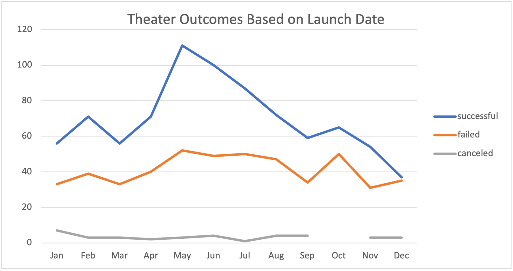
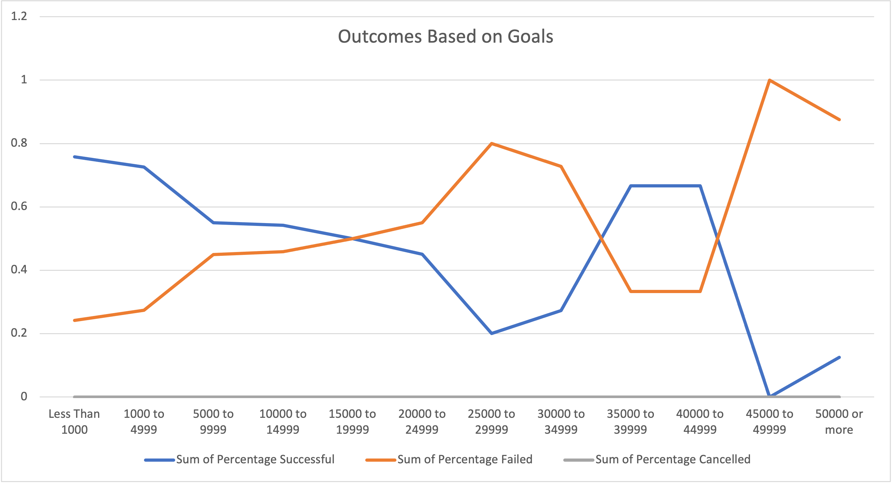

# An Analysis of Kickstarter Campaigns
## Overview of Project
### Louise is a playwright looking to successfully fund her play, Fever, through campaign fundraising. Louise's play came close to raising it's funding goal in a short period, and she wants to know how this campaign compares to other theater campaigns in relation to their fundraising goals and launch dates.  We will be able to determine the best month for her campaign to launch and the likelihood of her campaign's success based on fundraising goal. 

## Analysis and Challenges

### Analysis of Outcomes Based on Launch Date
In order to increase her chance of success, Louise wanted to determine the best month to launch her campaign.  We started by isolating the data to show only campaigns under the category of "theatre", filtering only campaigns that had the outcome of "successful", "failed" and "cancelled", and organizing by month the campaign launched.  This data is expected to inform the reader based on month the campaign is launched, what are the chances of success. 

### Analysis of Outcomes Based on Goals
Louise would also like to consider how likely her campaign is to succeed based on the fundraising goals of past theatre campaigns.  To perform this analysis, we isolated the data to show only campaigns under the category "theatre" and subcategory of "play", filtering only campaigns that had the outcome of "successful", "failed" and "cancelled", and organized based on 11 ranges of $5,000 increments for campaign goals between $0-$50,000, and grouping all goals above $50,000 as one range.  This data is expected to inform the reader about the likelihood of success based on the fundraising goals of the campaign.

### Challenges and Difficulties Encountered

Data in the Outcomes Based on Goals analysis was contradictory to the findings, which made the overall observations difficult to conclude.  We found that plays that had a range of $35000-$44999 had a dramtically higher chance of success when compared to the remainder of that data that suggests higher campaign goals meant lower chances of success.  We can see that based on the raw data and by filtering the number of campaigns in each range, there were very few theater campaigns with a range from $35000-$44999, which meant there was less data to determine the likelihood of success for campaigns within this range. This could influence the reader to conclude that campaigns with this goal range have a higher chance of success, when the success of campaigns with fundraising goals above $35000 are likely based on outliers. 

## Results

Based on the analysis for theatre outcomes when compared to launch date, we found:
- May to be the best month to start a campaign due to the high success rate of theatre campaigns launched in that month.
- December had about an equal chance of success or failure based on the near equal number of theatre campaigns that were successful and that failed in that month.

Based on the analysis for fundraising outcomes based on goal for plays specifically, we found: 
- As the funding goal for plays increased, the chance of success decreased.  This was found as a trend for both successful and failed play campaigns.  
  -Play campaigns that had the highest chance of success had the lowest goals.
  -Play campaigns that had the highest goals had the highest chance of failure.

### Limitations

The data sets shown do not evaluate a few key points: such as the success of the campaign compared to its launch and end dates or the number of campaigns evaluated for each goal range.  As stated above in Challenges and Difficulties encountered, the reader may be inclined to conclude campaigns between $35000-$44999 have a higher chance of success, without acknowledging the number of campaigns in each goal range.  We may also find additional insights by comparing the length of time a campaign was active compared to it's success rate, and average daily goal to keep track of the likelihood of success compared to campaign run time.  

Considering location as a factor, in colder climates, we may expect May to be a better month to launch a campaign because more people are active in the spring. In warmer climates, we may see a year long trend of consistent success for theatre campaigns because people are active all year round.  

### Recommendations

It is recommended that an evaluation of the outcomes based on goals be exhibited in box-plot to determine if the success of campaigns with goals above 35,000 represent outliers. 
Furthermore, it is recommended that campaign run times be evaluated to determine an appropriate length of time to run a campaign, using a line chart.  This would inform the reader if campaign length is a factor is the overall success of a campaign.    
